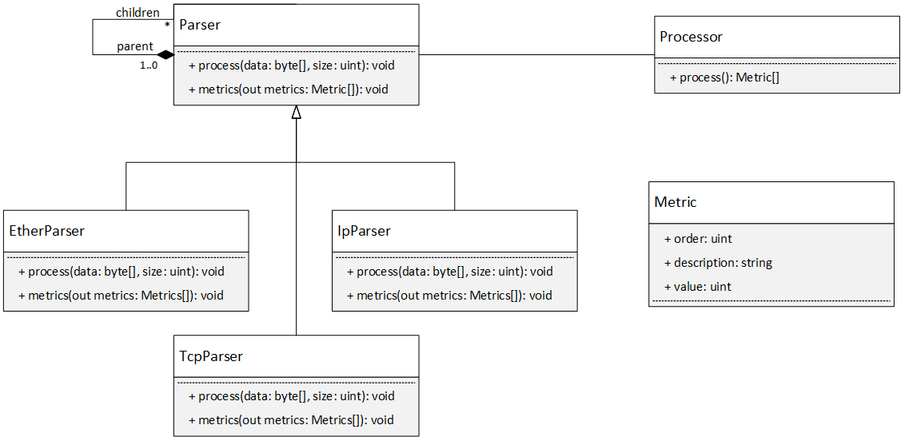
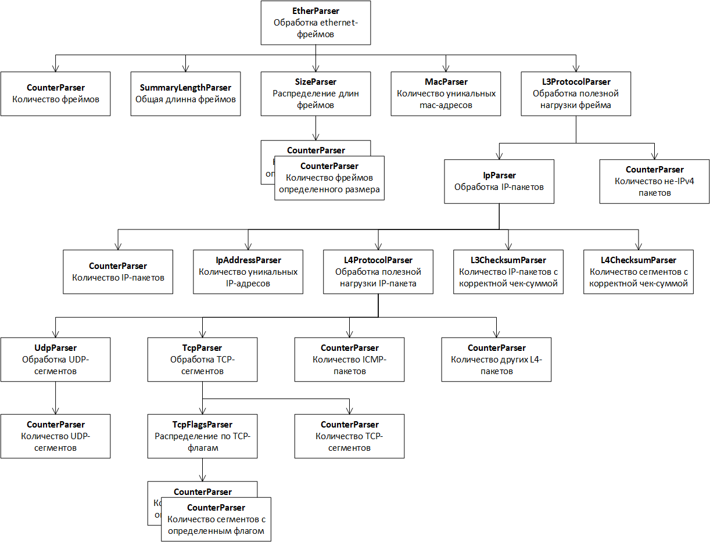

# Анализ сетевого трафика

## Задание
Библиотека Pcap (от англ. Packet Capture) позволяет создавать программы анализа сетевых данных, поступающих на сетевую карту компьютера. Libpcap также поддерживают сохранение захваченных пакетов в файл и чтение файлов, содержащих сохранённые пакеты. Программы, написанные на основе libpcap, могут захватить сетевой трафик, анализировать его. Файл захваченного трафика сохраняется в формате, понятном для приложений, использующих Pcap.

Программа должна принимать путь к pcap-файлу. Для каждого файла собрать статистику:
* Общее количество пакетов;
* Суммарная длина пакетов;
* Распределение длин пакетов в байтах: <=64, 65-255, 256-511, 512-1023, 1024-1518, \>=1519;
* Распределение по протоколам: Pv4, non-IPv4, TCP, UDP, ICMP, other-L4;
* Количество уникальных значений по полям: src_mac, dst_mac, src_ip, dst_ip, src_port, dst_port;
* Для TCP-пакетов pаспределение по флагам SYN, SYN+ACK, ACK, FIN, FIN+ACK, RST, RST+ACK, other;
* Количество пакетов с корректной и некорректной чексуммой L3 и L4 заголовков.

## Используемые инструменты
- IDE: Visual Studio Code
- Компилятор: GCC (--std=c++17)
- Сборочная система: CMake
- Система контроля версий: Git
- Библиотеки: libpcap для разбора pcap-файлов
- ОС: Linux Ubuntu 19.04

## Использование программы
packpars <pcap-файл>   
Выводит статистику пакетов по каждому pcap-файлу в директории.

## Структура директории
- .vscode - файлы конфигурации Visual Studio Code
- src - исходный код программы, включая файлы для сборки cmake
- test - набор тестовых pcap-файлов

## Основные классы

- Metric - структура хранит информацию об одной метрике в общей статистике
пакетов по текущему pcap-файлу:
    - order - задает порядок вывода метрик на экран;
    - description - текстовое описание метрики;
    - value - текущее значение метрики (целое беззнаковое число).

- Parser - наследники данного класса отвечают за разбор сетевых пакетов
всех уровней и сбор необходимой статистики.

    * Объекты класса Parser образуют древовидную композицию:
        - родительский компонент отвечает за время жизни своих потомков;
        - построение дерева парсеров начинается от корневого элемента;
        - при создании дочернего элемента ссылка на родителя задается в конструкторе базового класса Parser.
        
    * Методы класса Parser:
    
        - void process(const u_char* packet, size_t size) - виртуальный метод 
        производит разбор пакета. Многие реализации Parser работают по принцыпу декоратора - сами
        обрабатывают заголовок пакета, а тело передают на обработку дочерним парсерам, которые
        разбирают заголовки протоколов более высокого уровня.
        
        - void metrics(std::list\<Metric\>& metrics) - виртуальный метод собирает статистику
        для текущего парсера и всех его потомков.
        
        - std::unique_ptr\<Parser\> common() - фабричный метод конструирует дерево парсеров и
        возвращает коренной элемент - обработчик ethernet-фреймов.
        
    * Базовая реализация класса Parser работает как компоновщик - 
    производит рекурсивный вызов process и metrics для дочерних элементов.
    
- Processor - работа с библиотекой pcap, разбор pcap-файла и управление связанными с pcap ресурсами.

## Дерево парсеров

